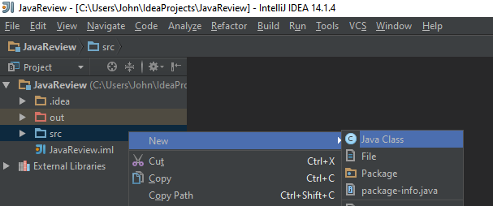

# Brief introduction to classes and methods
Before we dive into the Minecraft environment, you should understand what the words _class_ and _method_ mean in Java. At its most basic, a _class_ represents a real-world object by using code.

## Navigating IntelliJ

## Creating a main class
Go ahead and right-click on your main project package and select `Create new class`.  
  
Give it a name, we'll be calling ours `Main`, and click `OK`.  For this class only, you'll need to add the method `main` (note it is lowercase `main` since Java is case sensitive).  It should look like this:
```
public class Main {
    public static void main(String[] args) {

    }
}
```  
## Writing a new method
If you remember from Sequence 3, a function is a block of code that performs some action.  In Java we call functions _methods_.  In this case, our method will calculate and print the sum of two integers.  

```
public static int sum(int a, int b) {
    int total = a+b;
    return total;
}
```  
This block defines a method called `sum` that takes two _parameters_ (a and b).  The first line is called the method signature and defines its return type `int`.  In the second line, we define a new variable called `total` that is equal to `a+b`.  The third line returns `total`.  

Finally, we're going to _call_ our `sum` function and pass it two _arguments_, in this case two integers.  These _arguement_ values fill in the _parameters_ from the method definition.  Then we'll assign the result to a variable `result` and print it.  Your final code should look something like this:  
```
public class Main {
    public static void main(String[] args) {
        int result = sum(2,3);
        System.out.println(result);
    }

    public static int sum(int a, int b) {
        int total = a+b;
        return total;
    }
}
```  
To execute this code, go to `Run -> Run 'Main'`  
At the bottom it should print out the result, in this case 5.  `Process finished with exit code 0` just means the program ran successfully.  
## Defining a new class
Rectangle class
## Creating an object from a class

## Inheritance
Square class
