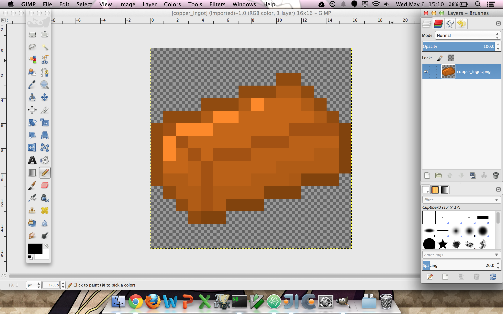

# Making basic items
Making an item is very similar to making a new block, except that we will be extending the `Item` class rather than the `Block` class.

```java
package com.example.coppermod;

import net.minecraft.item.Item;

public class CopperIngot extends Item {

}
```

Just as we did with our `CopperBlock` class, we can also add a constructor and give some properties to our `CopperIngot`.

```java
public CopperIngot()
{
    this.setUnlocalizedName("copper_ingot");
    this.setCreativeTab(CreativeTabs.tabMaterials);
    this.setTextureName("coppermod:copper_ingot");
}
```

One important note regarding textures is that item textures should have transparent backgrounds, or there will be a white square around the item in the game. Transparency backgrounds are indicated by a grey and white checkerboard on the background of the image file.



We'll also need to register our item with the game using the `registerItem` function. You should create a static `copperIngot` variable in `CopperMod` class just as we did with our static `copperBlock` variable.

```java
copperIngot = new CopperIngot();    //initializing the variable you should declare in the class
GameRegistry.registerItem(copperIngot, MODID + "_" + copperBlock.getUnlocalizedName());
```

## On-click effects
There are two methods that are called when the player right-clicks while holding an item. `onItemUse` is called when the player is targeting a block in range (ie. the block has the black wireframe around it), while `onItemRightClick` is called regardless of what the player is targeting (ie. even if they are looking at the sky).

`onItemUse` gives us several parameters that we can use to make _something_ happen when an item is used.
```java
@Override
public boolean onItemUse(ItemStack itemstack, EntityPlayer player, World world, int p_77648_4_, int p_77648_5_, int p_77648_6_, int p_77648_7_, float p_77648_8_, float p_77648_9_, float p_77648_10_)
{
    return false;
}
```

`onItemRightClick` is a bit more general and primitive. There are fewer arguments given to us,
  @Override
public ItemStack onItemRightClick(ItemStack itemstack, World world, EntityPlayer player)
{
    return itemstack;
}
```
