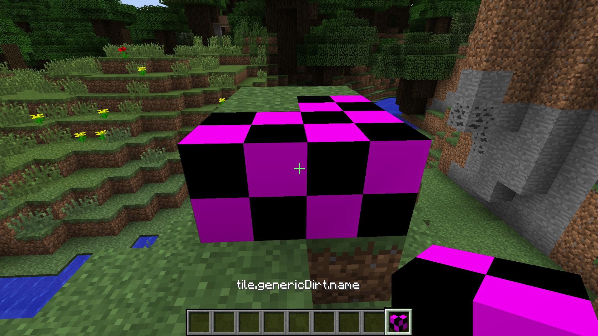
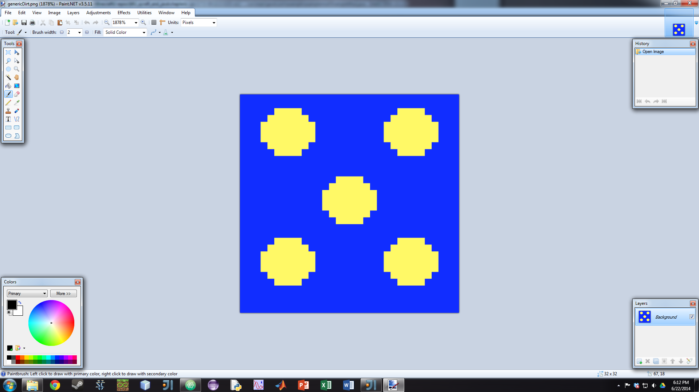
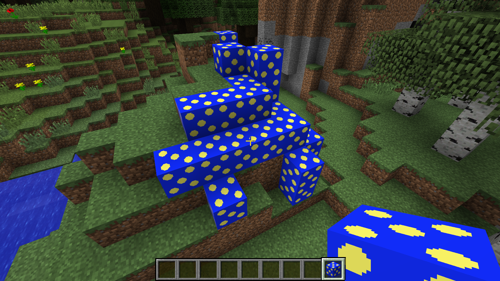

# Minecraft mod development
>You should have performed the setup steps in section_7 before going through this lesson.

## What is a _mod_?
The word _mod_ is short for _modification_. A _mod_ is made up of code and images that change how Minecraft works. You can add new ores, new items, new foods, and even new mobs and monsters! In previous sequences, you learned about programming using the ComputerCraft mod, an advanced mod that adds turtles and computers into the world of Minecraft. By learning how to program in Java and create your own textures, you can add just about anything you want into the world of Minecraft. In this sequence, we're first going to learn how to add new blocks and items and then move onto more advanced topics like custom crafting tables and armor.

## Creating a new block

>Anytime you copy Java code in this section, be sure to match ALL capitalization and punctuation as exactly as possible.

Programmers use something called a _class_ as a blueprint for all of the objects in Minecraft. There's a class for a diamond pickaxe, for an iron ore, and all other blocks and items. These classes tell what a block (or item) should look like, how it should behave, as well as where it spawns or how it can be crafted. By creating our own classes, we can add our own blocks and items to the game. Let's say that we wanted to make a new type of block. Minecraft already has a `Block` class that defines what a block is in the game (all blocks can be broken and have a texture, for example). We can _extend_ the existing `Block` class and make our own new block. It will have all the normal properties of a block but we can set our own texture, hardness, and sound.

For this lesson, we're going to create a new resource in Minecraft: copper. We'll have to make copper ore, copper ingots, copper tools, and all the other items associated with it (think of the tools and other items made from iron or diamond). First, you should create a new class called `CopperBlock` by right-clicking on the package and choosing _Create new class_. Name it `CopperBlock` and press OK. The file that opens up will have code almost matching what I've written below. You should add the lines with comments (use `//` to make a comment in Java) after them so that it matches exactly.

```java
package com.example.coppermod;

import net.minecraft.block.Block; //Add me

public class CopperBlock extends Block //Add the second half of this line
{

}
```
The keyword `class` means that we are creating a new class. By extending the `Block` class, our `CopperBlock` class will inherit all of the attributes of the existing `Block` class. We call `Block` the _parent class_ of `CopperBlock`, while `CopperBlock` is the _child class_ of `Block`.

An error will come up regarding a missing _constructor_. A constructor is a function that runs whenever a new block is created in the game. The following constructor should go inside the braces of the `CopperBlock` class. If your cursor is over `CopperBlock`, you should be able to press Alt-Enter and select "Add missing constructor". Then change the name of the `Material` parameter to `mat` and fill in the rest of the constructor.

```java
public CopperBlock(Material mat)
{
    super(mat);

    this.setBlockName("copper_block");
    this.setHardness(5.0F);
    this.setStepSound(Block.soundTypeMetal);
    this.setCreativeTab(CreativeTabs.tabBlock);
    this.setBlockTextureName("coppermod:copper_block");
    this.setHarvestLevel("pickaxe", 2);
}
```
`super` calls the constructor of `CopperBlock`'s parent, `Block` (don't worry about this too much for now). We mainly want to focus on the rest of the functions. Each of them defines an attribute of our `CopperBlock` block, most of which should be obvious from the name. For example, `setStepSound` determines which sound the block will make when placed. `setHarvestLevel` determines what type and level of tool is required to successfully mine it (the number 2 means iron). The keyword `this` means that the function is part of the class whose constructor you're currently in, `CopperBlock` in this case (don't worry about this too much, either).

However, simply making a new class is not enough. To actually add our block into the game, we need to register it with Minecraft Forge. Open the `CopperMod` class from the left side of the screen (it might still be called `ExampleMod` initally; just rename it to `CopperMod` if so). Add the variable declaration line and the `registerBlock` line shown below. The second argument of `registerBlock` sets up the name of the block as "_modid_\__blockname_" and lets us use the same code to create a standardized naming system for all of our blocks. In addition, by using our _MODID_ in the names of our blocks, we can make sure there won't be any overlaps with any other mods we may want to add.

```java
public static CopperBlock copperBlock;  //static variable declaration

@EventHandler
public void init(FMLInitializationEvent event)
{
    copperBlock = new CopperBlock(Material.iron);
    GameRegistry.registerBlock(copperBlock, MODID + "_" + copperBlock.getUnlocalizedName());
}
```
This block of code registers our newly-created block with the game.

So to recap, our `CopperMod` and `CopperBlock` classes should look as follows.

```java
package com.example.coppermod;

import cpw.mods.fml.common.Mod;
import cpw.mods.fml.common.Mod.EventHandler;
import cpw.mods.fml.common.event.FMLInitializationEvent;
import cpw.mods.fml.common.registry.GameRegistry;
import net.minecraft.block.material.Material;

@Mod(modid = CopperMod.MODID, version = CopperMod.VERSION)
public class CopperMod
{
    public static final String MODID = "coppermod";
    public static final String VERSION = "1.0";

    public static CopperBlock copperBlock;

    @EventHandler
    public void init(FMLInitializationEvent event)
    {
        copperBlock = new CopperBlock(Material.iron);
        GameRegistry.registerBlock(copperBlock, MODID + "_" + copperBlock.getUnlocalizedName());
    }
}
```

```java
package com.example.coppermod;

import net.minecraft.block.Block;
import net.minecraft.block.material.Material;
import net.minecraft.creativetab.CreativeTabs;

public class CopperBlock extends Block
{
    protected CopperBlock(Material mat) {
        super(mat);
        this.setBlockName("copper_block");
        this.setHardness(5.0F);
        this.setStepSound(Block.soundTypeMetal);
        this.setCreativeTab(CreativeTabs.tabBlock);
        this.setBlockTextureName("coppermod:copper_block");
        this.setHarvestLevel("pickaxe", 2);
    }
}
```

To actually launch our modded Minecraft, run the project by clicking on the green arrow at the top of the IDE. Make a new creative world and try placing your block on the ground. It should be under the normal _Blocks_ tab at the very bottom and will be called _tile.copper_block.name_. The coloring should be a purple and black checkerboard, the default color scheme when a texture is not specified. Even though we said the texture file's name should be _copper\_block_ in the code, Minecraft can't find the texture file because we haven't made one!



## Adding a texture to a block

To add our texture to our block, we first need to create the folder that will hold our textures. The full path is "src/main/resources/assets/coppermod/textures/blocks". Start at the "resources" folder (it should already exist) and create one folder after another until you get down to the final one, "blocks". Open up Paint (or another image-editing program) and create a new empty canvas with a square resolution. Most Minecraft textures are 16x16 but you could also try 32x32 or 64x64. Take a few minutes and make your own texture!



For right now, the block will have the same texture on all six sides like cobblestone or obsidian. Save the texture as "copper_block.png" in the "blocks" folder. After your texture has been saved, run Minecraft. Now check out the texture of your block!


