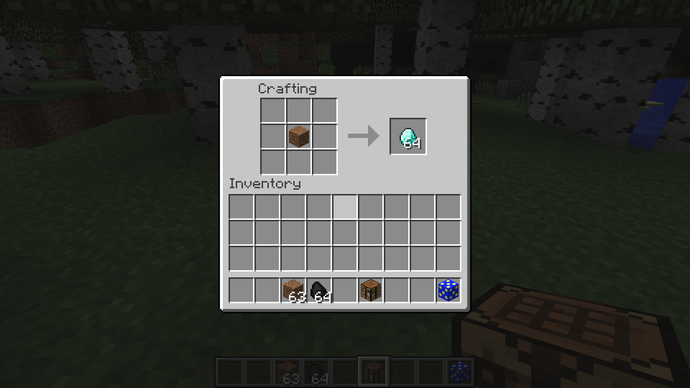
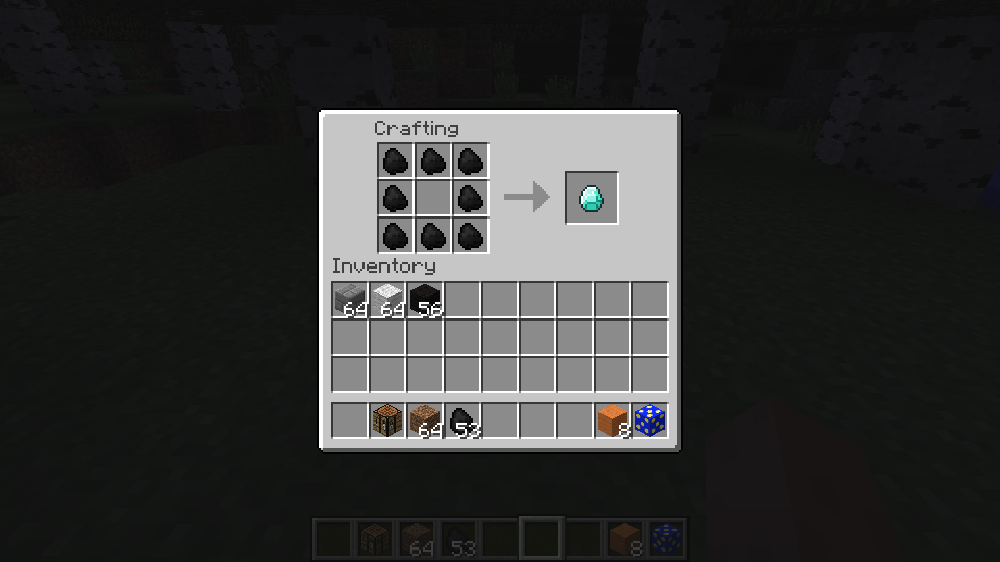
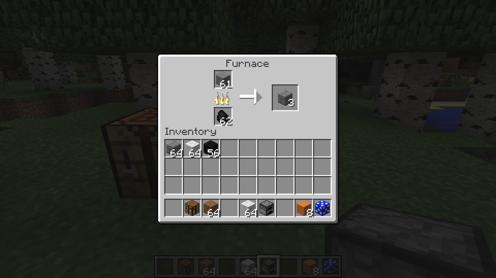
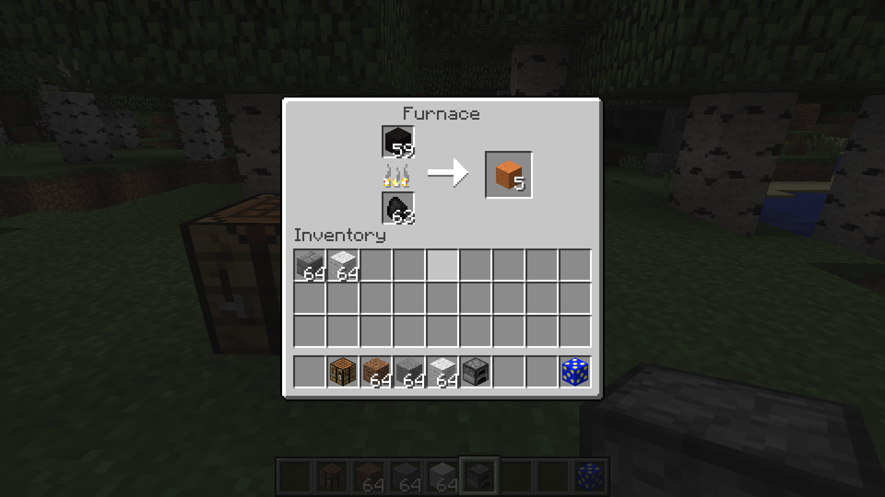

# Mod Dev

## Making new crafting recipes

There are two types of recipes we can create as well: shapeless and shaped. Shapeless recipes (such as making wooden planks from wood) don't require the items to be in any specific orientation to work. Shaped recipes (such as making tools) requires blocks to be in specific locations for the recipe to function. You will also need to import the ItemStack and Items classes to use these calls (IntelliJ will prompt you for them when you type your functions).

### Important!
These crafting and smelting recipes go in our original ExampleMod class.

### Steps

1. First, let's make a shapeless recipe.
```java
GameRegistry.addShapelessRecipe(new ItemStack(Items.diamond, 64), new ItemStack(Blocks.dirt));
```
This recipe simply trades in a stack of 64 dirt blocks for 64 diamonds.


1. To add more items, simply add more ItemStacks within the parentheses.
```java
GameRegistry.addShapelessRecipe(new ItemStack(Items.diamond, 64), new ItemStack(Blocks.dirt),
    new ItemStack(Blocks.dirt), new ItemStack(Blocks.dirt));
```


1. Next, let's make a shaped recipe. Shaped recipes group the rows of items using letters to represent the type of block. For example, the recipe for TNT would be: `("xyx", "yxy", "xyx", 'x', new ItemStack(Materials.sulphur), 'y', new ItemStack(Blocks.sand))` Pay attention to the double-quotes for the letters representing the recipe shape and the single-quotes for the letters representing the items in the recipe.
> Note: when we leave out the size of the ItemStack, the game will assume a size of 1.

1. An example of a shaped recipe. You use three strings to represent the three rows of the crafting table and define which letters relate to which type of item. Spaces are used to represent empty crafting slots.
```java
GameRegistry.addShapedRecipe(new ItemStack(Items.diamond), "xxx", "x x", "xxx", 'x',
    new ItemStack(Items.coal));
```


## Smelting recipes

1. Smelting recipes are very similar and only require a slightly different function call.
```java
GameRegistry.addSmelting(Blocks.stone, new ItemStack(Blocks.stonebrick), 0.1f);
```
This time, the input item is on the left while the output is on the right. The number at the end specifies how much experience the player receives from the smelting.


1. On a side note, the _damage values_ of items often hold _metadata_ about the block. For example, all the colors of wool are actually the same type of block. They're rendered differently based on the value of their damage value. We can use this data value in our recipes to alter what kinds of wool, clay, or wood are required.
```java
//What do you think this smelting recipe does?
ItemStack woolStackBlack = new ItemStack(Blocks.wool);
ItemStack woolStackOrange = new ItemStack(Blocks.wool);
woolStackBlack.setItemDamage(15);
woolStackOrange.setItemDamage(1);
GameRegistry.addSmelting(woolStackBlack, woolStackOrange, 0.1f);
```


## Setting names
The names that we've given our new blocks and items so far are all hard-coded into our mod. But what if we want people in other countries who speak different languages to play our mod? We can use what are called _language packs_ to give our items language-specific names. The packs also replace the cumbersome "package.item.item"-type names with real names such as "Iron Ingot" or "Dirt".

#### File Extensions
Before we create our language packs, make sure you have "hide file extensions for known file types" disabled. To check if its disabled, go look at your textures.  If they show up as "_name_.png" you're good.  Otherwise, follow these instructions.  

##### Windows
1. Start -> Control Panel -> Appearance and Personalization -> Folder Options
2. Click on "View" tab
3. Click "Advanced settings"
4. Uncheck the box next to "Hide extensions for known file types" then click "OK"

##### Mac
1. Select Finder -> Preferences -> Advanced
2. Select "Show all filename extensions"

## Language Packs
1. Create a folder called "lang" in the "assets/examplemod" folder.

1. Create a new text file called "en_US.lang" in the folder.


1. Right-click on the file and choose to edit it. The default entry is something similar to: ```category.blockName.name=Item Name```. The name that appeared for our initial block, `tile.genericDirt.name` is what we would use in our case. So my line would be `tile.genericDirt.name=CookieDice`.

1. Save the file and run Minecraft. Your name should now appear in-game.

