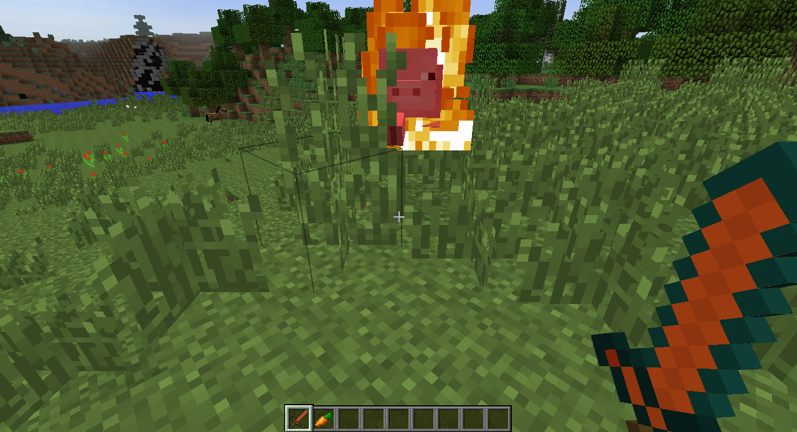
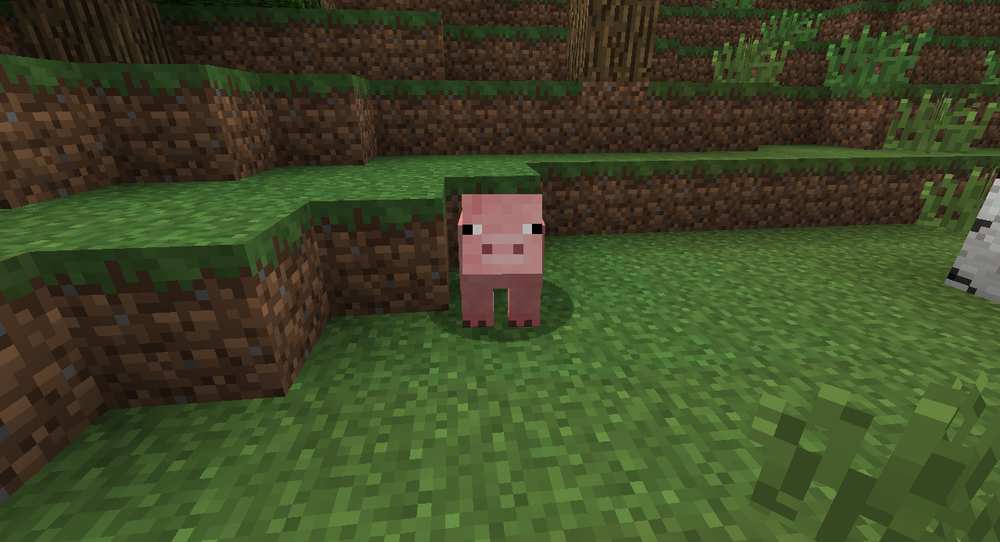

# Making new tools

## Custom ToolMaterial

First, we should go ahead and make our own `ToolMaterial`. A `ToolMaterial` is an object that holds all of the information about a material that can be made into tools. Minecraft already has them for materials such as wood and iron, but we need to make one for copper. We use the `EnumHelper` class to actually create our new material variable (this variable declaration goes in our main mod class).

```java
public static final Item.ToolMaterial COPPER = EnumHelper.addToolMaterial("copper_tool", 2,
            150, 5.0F, 7.0F, 21); //Harvest level, durability, block damage, entity damage, enchantability
```

Note that the `addToolMaterial` method takes a total of six arguments. The first argument is a string that will be registered as the name of our material. The other five arguments are numbers that determine attributes of the material:  

* Harvest level (0-3): Determines what types of blocks the tools can break properly (0 is wood, 3 is diamond).  
* Durability (Diamond = 1562): The number of uses before the tool breaks.  
* Block and Entity damages: Determine how much damage the tool material does to blocks and entities, respectively (these arguments are floats).  
* Enchantability (Gold Armor = 25): How well a tool can be enchanted (higher number means better enchantments at lower levels).  

Since we've made `COPPER` a static variable, we can later refer to it as `CopperMod.COPPER` for registering our tools with the game. Generally, `final` variables are in all-caps, therefore we call our `final` variable `COPPER`.

## Making the tool class

```java
public class ItemCopperPickaxe extends ItemPickaxe
{
    //as if it was a shovel
    private static Set effectiveAgainst = Sets.newHashSet(new Block[]{
            Blocks.grass, Blocks.dirt, Blocks.sand, Blocks.gravel,
            Blocks.snow_layer, Blocks.snow, Blocks.clay, Blocks.farmland,
            Blocks.soul_sand, Blocks.mycelium});

    public ItemCopperPickaxe(ToolMaterial tm, String name)
    {
        super(tm);

        setUnlocalizedName(name);
        setTextureName(CopperMod.MODID + ":" + getUnlocalizedName().substring(5));
    }

    //unsure if these are the correct params or not
    @Override
    public boolean onBlockDestroyed(ItemStack itemstack, World world, Block blockBroken,
                                    int x, int y, int z, EntityLivingBase player)
    {
        System.out.println("Broke block " + blockBroken.getUnlocalizedName());
        //isRemote is TRUE FOR CLIENT AND FALSE FOR SERVER
        if (!world.isRemote) {
            world.setBlock(x, y, z, Blocks.air);
            world.spawnEntityInWorld(new EntityItem(world, x, y, z, new ItemStack(Blocks.obsidian, 1)));
        }
        return false;
    }

    @Override
    public Set<String> getToolClasses(ItemStack stack) {
        return ImmutableSet.of("pickaxe", "spade"); //is both a pickaxe and spade
    }
}
```

### Custom tool effects
By knowing how to override the `hitEntity` function, we can create fire, lightning bolts, and even explosions when our tools are used!

Create the following function definition in one of your item classes.

```java
public boolean hitEntity(ItemStack itemHitting, EntityLivingBase entityBeingHit, EntityLivingBase entityHitting)
{

}
```

This function is called whenever the item is used to hit an entity, whether it's a zombie or a spider or even a cow. The `entityBeingHit` variable points to the `Entity` object being hit in the game, and it is the variable that we can use to give effects to our item. For example, we can set the entity on fire when hit.

```java
entityBeingHit.setFire(4);  //what do you think the integer does?
```



We can even create an explosion at the hit entity's location!

```java
entityBeingHit.worldObj.createExplosion(null, entityBeingHit.posX, entityBeingHit.posY, entityBeingHit.posZ,
3.0f, true);  //the float determines the radius of the explosion
```




