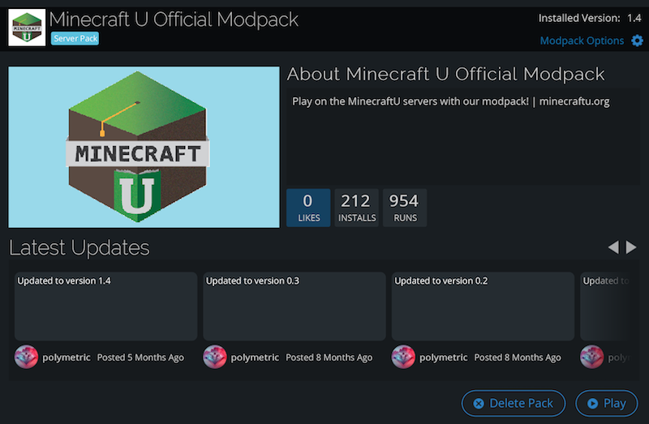
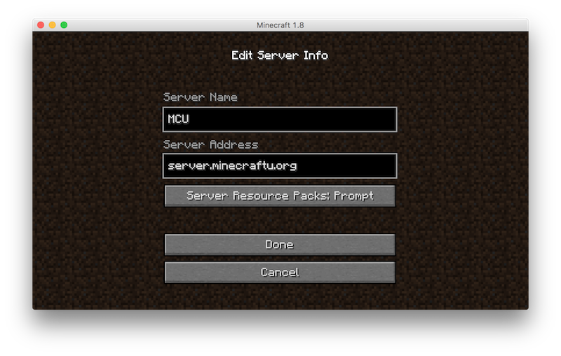
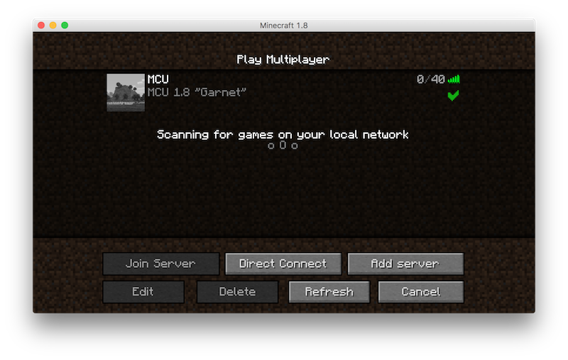

<!-- BREAK -->
#### MCU Server Info

Server address: **server.minecraftu.org**
Server runs a modded version of Minecraft 1.8.

##### Installing the Modpack

* Navigate to [the Technic website](http://technicpack.net/) and click the "Get the Launcher" button on that page.
* Once you've downloaded the launcher, save it somewhere where you'll be able to find it later.
* Open the launcher. On most platforms, this is as simple as double clicking it.
* When you open Technic, it will set itself up, then ask you for a username and password. Log in just like you do to the normal Minecraft launcher, with your Minecraft username (or email) and password.
* Once you're logged in, click the middle tab at the top of the launcher, then search for **MCU**. You should see the "Minecraft U Official Modpack". Install that by clicking it and then clicking the install button.

**Congrats! You are now on the most up to date version of the Minecraft U mod pack, and can play on our moderated servers, or alone.**

**Just click the modpack in the Technic Launcher to start playing!**

To join our server, choose 'Multiplayer' and then 'Add server'. Enter `server.minecraftu.org` as the 'Server Address'.

 
 
 

##### Current Mod list

* [Dr. Cyano's Wonderful Wands & Wizarding Armor](http://www.minecraftforum.net/forums/mapping-and-modding/minecraft-mods/2233889-dr-cyanos-wonderful-wands-and-wizarding-robes)
* [Iron Chests](http://ftbwiki.org/Iron_Chests)
* [ComputerCraft](http://www.computercraft.info/2015/12/24/computercraft-1-76/)!