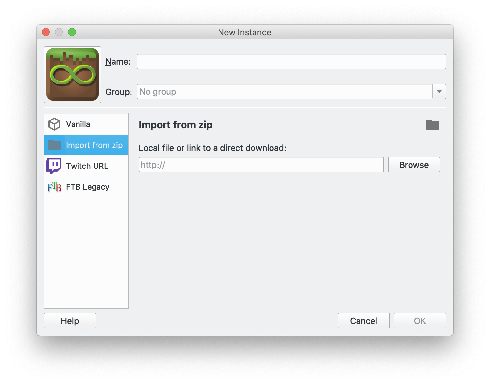

## Creative Server

This is a vanilla Minecraft server. This server can be joined from default Minecraft, MultiMC or the Vanilla Technic Modpack as long as they are running version 1.13.2.

* Server address: **mcucreative.mcph.co**
* Minecraft version: 1.13.2

This is a whitelisted server. To be added to the server email your username to info@minecraftu.org. 

Since 1.13.2 is not the most recent version of Minecraft (which the standard Minecraft application from Microsoft will be running), we suggest using [MultiMC](https://multimc.org/) to create a 1.13.2 "instance" of Minecraft to connect to the server.

## ComputerCraft Survival Server

This is a modded server requiring the [ComputerCraft](http://www.computercraft.info/) mod.

Install Minecraft and ComputerCraft using the [instructions in Level 4](https://github.com/MinecraftU/mcu-curriculum/blob/master/level_4/section_1.md#installing-computercraft) or by installing the [Minecraft U modpack on Technic](https://www.technicpack.net/modpack/mcu.743668). 

* Server address: **mcucc.mcph.co**
* Minecraft version: 1.8.9
* ComputerCraft version: 1.7.9 (requires Forge)

This is a whitelisted server. To be added to the server email your username to info@minecraftu.org. This server is recommended for students who have completed Level 4 of the Minecraft U curriculum or are familiar with ComputerCraft. It is a survival world.

## Modded 1.12.2 Survival Server

This is a modded server that includes the following mods:

* [Cooking for Blockheads](http://blay09.net/mods/cookingforblockheads/?page=cookingforblockheads)
* [JurassiCraft](https://www.curseforge.com/minecraft/mc-mods/jurassicraft)
* [MoSwords](http://www.9minecraft.net/moswords-mod/)
* [Pam's HarvestCraft](https://www.minecraftmods.com/pams-harvestcraft/)
* [Switch Bow Mod](http://www.9minecraft.net/switch-bow-mod/)

The modpack also includes client-side mods:

* Inventory Tweaks
* JourneyMap
* OptiFine

We created this server to just have a bit more fun with the mods available on 1.12. Cooking for Blockheads and Pam's HarvestCraft combine to create quite a culinary experience within Minecraft. JurassiCraft for the paleontologist in each of us. MoSwords and Switch Bow because who doesn't like better weapons?

This is a survival server set to Peaceful, so the weapons aren't actually good for much. There aren't any monsters except for those that come from spawners. 

To play on this server:

* Download the MultiMC instance from here: [http://bit.ly/MCU-Cooking](http://bit.ly/MCU-Cooking). If you don't have MultiMC get it here: [https://multimc.org](https://multimc.org)
    * The bit.ly link goes to Dropbox, which displays the ZIP file like a normal folder. To download the ZIP, click "Open with" in the upper right:

* Create a new instance in MultiMC and choose "Import from ZIP":
  
    * Browse to a select the ZIP file downloaded from the link above.
    * You can also just drag the ZIP file into the main MultiMC window and it will auto-fill the ZIP location.
* The server should already be available on the servers screen. If not, the server address is: **mcucooking.mcph.co**

This is a whitelisted server. To be added to the server email your username to info@minecraftu.org.
